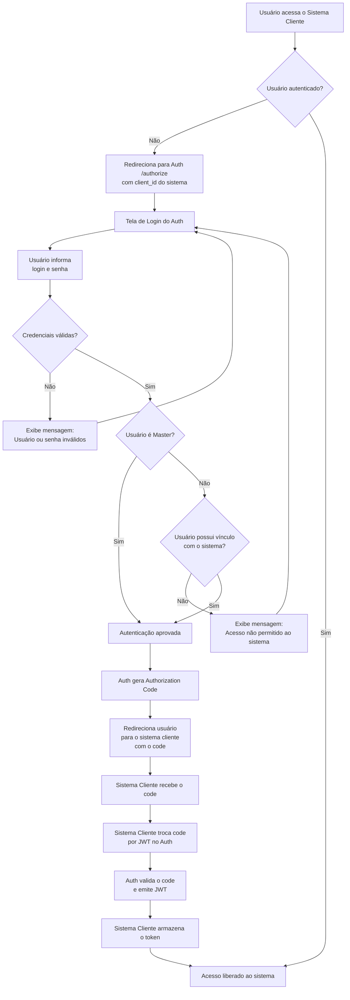

# Documento Arquitetural — Auth Server
## Fluxo de Login (OAuth2 Authorization Code Flow)

---

## 1. Objetivo do Fluxo

Este documento descreve o **Fluxo de Login** utilizado pelo Auth Server para autenticação e autorização de usuários que acessam sistemas clientes.

O fluxo tem como objetivos principais:

- Autenticar o usuário de forma centralizada
- Validar o acesso do usuário ao sistema solicitante
- Emitir credenciais de acesso de forma segura (JWT)
- Desacoplar os sistemas clientes da lógica de identidade
- Aderir aos padrões OAuth2 e OpenID Connect

---

## 2. Visão Geral do Fluxo

O fluxo implementa o **OAuth2 Authorization Code Flow**, com validações adicionais de autorização por sistema.

Visão resumida:

1. Usuário acessa um sistema cliente
2. Sistema verifica se o usuário já está autenticado
3. Caso não esteja, redireciona para o Auth Server
4. Auth Server autentica o usuário
5. Auth Server valida autorização de acesso ao sistema
6. Auth Server emite Authorization Code
7. Sistema cliente troca o code por um JWT
8. Acesso é liberado ao sistema

---

## 3. Escopo do Fluxo

Este fluxo contempla:

- Autenticação de usuários via credenciais (login/e-mail e senha)
- Autorização de acesso por sistema cliente
- Tratamento de usuário Global (MASTER)
- Emissão de Authorization Code
- Troca do Authorization Code por JWT

Ficam fora deste fluxo:

- Recuperação de senha
- Refresh Token
- Logout
- Permissões funcionais internas aos sistemas clientes

---

## 4. Participantes do Fluxo

| Participante | Responsabilidade |
|--------------|------------------|
| Usuário | Inicia o acesso ao sistema |
| Sistema Cliente | Solicita autenticação e consome o token |
| Auth Server | Autentica, autoriza e emite tokens |

---

## 5. Diagrama do Fluxo (Mermaid)

---

## 6. Descrição Detalhada do Fluxo

### 6.1 Início do Acesso

1. O usuário acessa um sistema cliente.
2. O sistema verifica se existe uma sessão válida.
3. Caso exista, o acesso é liberado imediatamente.

### 6.2 Redirecionamento para Autenticação

1. Se o usuário não estiver autenticado, o sistema cliente redireciona para o endpoint /authorize do Auth Server.
2. O redirecionamento contém, no mínimo:
    - client_id (identificador do sistema cliente)
    - redirect_uri
    - response_type=code

### 6.3 Autenticação de Credenciais

1. O Auth Server apresenta a tela de login.
2. O usuário informa login/e-mail e senha.
3. O Auth Server valida as credenciais:
    - **Credenciais inválidas:**
      - Uma mensagem genérica é exibida:
      > “Usuário ou senha inválidos”
      - O usuário permanece na tela de login.
    - **Credenciais válidas:** 
      - Usuário é redirecionado para o sistema cliente.

### 6.4 Validação de Autorização por Sistema

Após credenciais válidas, o Auth Server avalia a autorização:

- **Usuário MASTER**
    - Usuários com perfil Global (MASTER) possuem acesso automático a todos os sistemas.
    - Nenhuma validação adicional de vínculo é necessária.

- **Usuário Comum**
    - O Auth Server valida se o usuário possui vínculo com o sistema solicitante.
    - Caso não possua:
        - O acesso é negado
        - Uma mensagem é exibida:
        > “Acesso não permitido ao sistema”

### 6.5 Emissão do Authorization Code

1. Após autenticação e autorização bem-sucedidas, o Auth Server gera um **Authorization Code:**
    - Código temporário
    - Uso único
    - Associado ao usuário e ao sistema cliente
5. O usuário é redirecionado de volta ao sistema cliente com o code.
 
### 6.6 Troca do Code por Token

1. O sistema cliente recebe o Authorization Code.
2. Em comunicação server-to-server, o sistema cliente:
    - Envia o code ao Auth Server
    - Solicita a emissão do token
3. O Auth Server:
    - Valida o code
    - Emite um JWT

### 6.7 Finalização

1. O sistema cliente armazena o token de forma segura.
2. A sessão local é criada.
3. O acesso ao sistema é liberado ao usuário.

---

## 7. Responsabilidades por Componente

**Auth Server**
- Autenticar credenciais
- Validar autorização por sistema
- Gerar Authorization Code
- Emitir JWT
- Centralizar regras de identidade

**Sistema Cliente**
- Redirecionar para autenticação
- Trocar Authorization Code por JWT
- Validar token
- Criar e manter sessão local
- Aplicar permissões funcionais internas

---

## 8. Padrões e Protocolos Utilizados

- OAuth2 — Authorization Code Flow
- OpenID Connect
- JWT (JSON Web Token)
- HTTPS obrigatório em todas as comunicações

---

## 9. Considerações de Segurança

- Credenciais nunca são compartilhadas com sistemas clientes
- Senhas nunca são expostas aos sistemas clientes
- O Authorization Code é temporário e de uso único
- Tokens possuem validade limitada
- O JWT é emitido apenas após autenticação e autorização
- Validação de acesso ao sistema ocorre antes da emissão do token
- A validação de acesso por sistema ocorre exclusivamente no Auth Server
- Mensagens de erro não revelam informações sensíveis
- Permissões funcionais são responsabilidade do sistema cliente

---

## 10. Aderência a Padrões

Este fluxo está alinhado com:
- OAuth2 Authorization Code Flow
- OpenID Connect
- Boas práticas de segurança para autenticação centralizada

---

## 11. Relacionamento com Outros Fluxos

Este fluxo se relaciona com:
- Fluxo de Recuperação de Acesso
- Fluxo de Refresh Token
- Fluxo de Logout
- Modelo Conceitual de Autorização

---